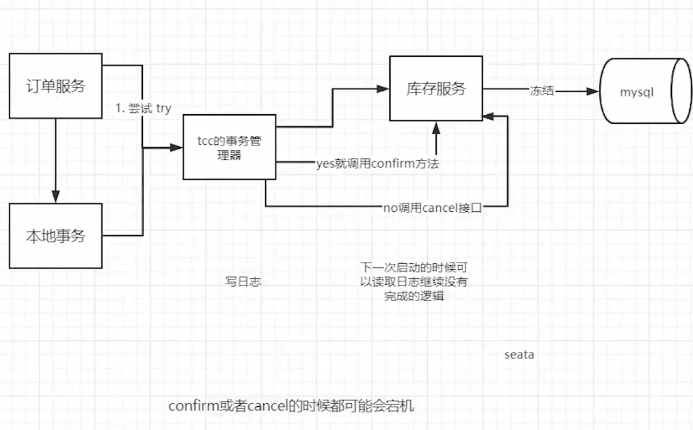
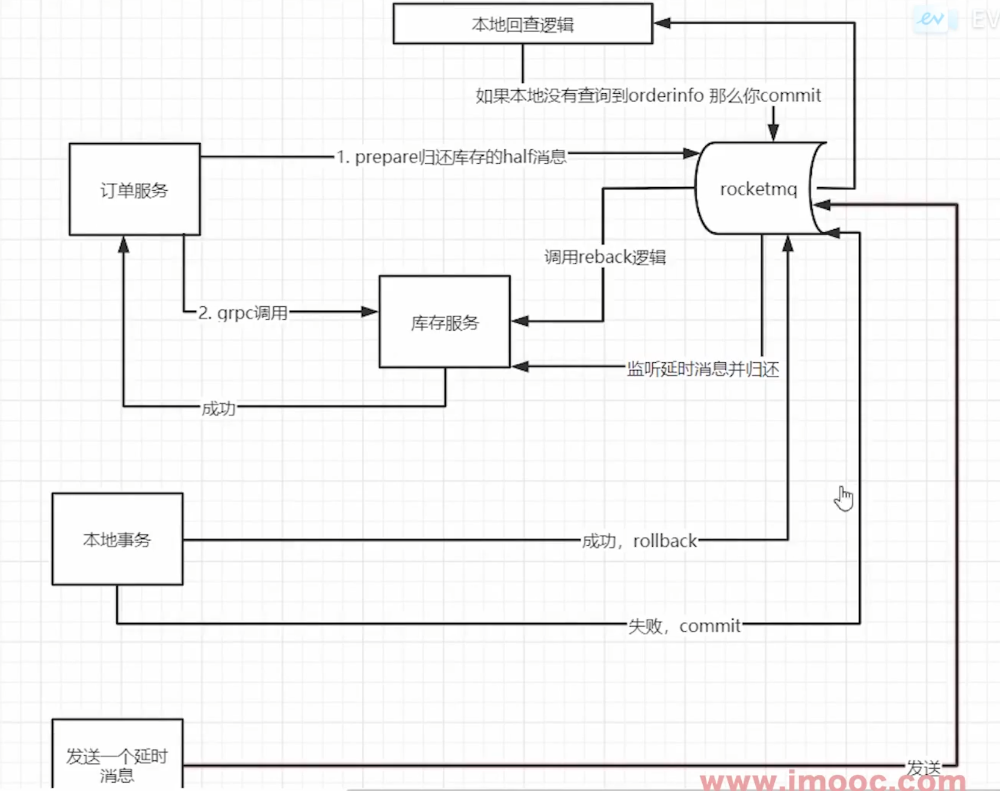

+++
date = '2025-06-27T14:54:26+08:00'
draft = false
title = '分布式事务'
+++

## 需要注意的是
并不是所有的接口都要做分布式事务一致性。

## 为什么会导致数据不一致
### 网络问题 
- 硬件故障 
- 网络抖动 
- 网络拥塞：半天收不到消息
- 表现为
  -  没发出去
  -  发出去了，返回没收到，导致以为出错了

### 程序出错
1. 代码异常
2. 宕机
   1. 断电
   2. 硬盘/内存满了

## 超时机制

## 重试

# 常用的分布式事务解决方案
至少要同时成功或者同时失败
1. 两阶段提交
2. TCC补偿
3. 基于本地消息表实现最终一致性
4. 最大努力通知
5. 基于可靠消息最终一致性方案
## 两阶段提交
1. 概念：
   1. 协调者：调用多个服务的
   2. 参与者：参与服务调用的
   3. 过程：协调者向参与者发起请求，参与者开启事务，然后进行业务操作。协调者进行了自己的业务操作之后，根据成功/失败通过参与者提交/回滚。
2. 缺点 （采用到了数据库的锁）
   1. 协调者和参与者都要加锁，因为是通过通知的方式进行事务控制提交/回滚。
   2. 性能问题
   3. 单点故障/网络故障导致系统不可用

## TCC 分布式事务 
1. 第一步  
2. TCC失败 
3. TCC回滚 
4. 过程
5. TCC 会记录各个分布式服务的调用和执行状态
6. 优缺点：
   1. 优点：
      1. 解决了跨服务的原子性问题。
      2. 解决了二阶段提交提升到微服务中实现，避免数据库2阶段中锁冲突的长事务风险
      3. TCC异步高性能，先try，异步comfirm
   2. 缺点
      1. 对微服务入侵性很其强，微服务的每个事务都要实现 try，confirm，cancel。开发成本高，维护成本也高
      2. 为了一致性，try，confirm，cancel必须要保持一致性（定时器+重试）
      3. 由于是事务管理记录事务日志，必然后性能损耗，使得TCC事务时间拉长
      4. TCC需要通过锁老保证数据的一致性，加锁导致性能不高、

## 基于本地消息表的最终一致性

## 基于可靠消息的最终一致性

1. 缺点： 整个事务依赖了rocketmq，需要额外维护组件。
2. 
## 最大努力通知
1. 比如支付宝的支付回调通知
2. 顺便提供一个查询接口