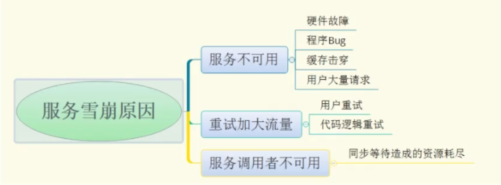
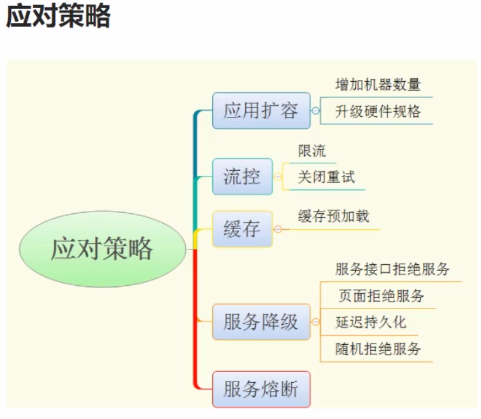

+++
date = '2025-07-10T10:05:52+08:00'
draft = true
title = '熔断限流降级'
+++

## 服务雪崩

1. 服务提供者不可用：数据库很慢/服务宕机/流量太大处理不过来
2. 重试加大请求流量
3. 调用者不可用

### 导致的问题
1. 服务大规模不可用，因为依赖于这个组件

### 应对策略

## 熔断
1. 类似于保险丝，遇到问题，直接熔断
2. 金融熔断

## 限流
1. 对请求的流量进行限制，避免导致服务不可用

## 降级
1. 原来的服务是提供稳定，可用的服务
2. 为了应对突如其来的流量，将部分用户引导至“当前访问用户过多，请稍后重试”或者点击返回主页的页面。
3. 避免出现大流量导致服务不可用的情况

## 熔断限流技术选型
### sentinel -- 国内开源，功能更加丰富
### Hystrix  -- 不更新了，所以不选

## sentinel-golang
1. 测试