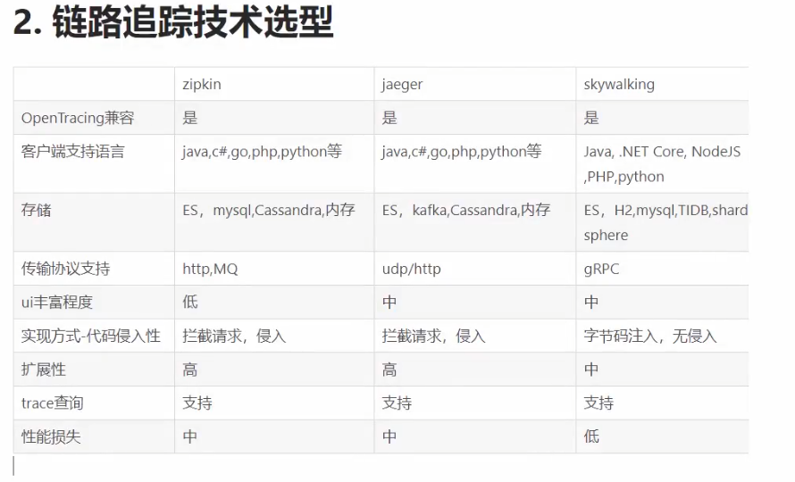

+++
date = '2025-07-06T09:17:57+08:00'
draft = true
title = '链路追踪'
+++

技术选型：


## 自己感觉
1. 因为分布式系统，各自的日志都记录在自己的系统上，有问题不好排查
2. 统一存储，并且一一定的链路ID存储起来，方便排查问题
3. 就是统一存储在一个地方，方便存储和排查

## 核心
1. 代码埋点
2. 数据存储
3. 数据查询

## jaeger
1. 支持openTrace
2. upd/http传输协议
3. 存储方式：内存、ES...

## openTrace标准：定义了链路追踪的系统应该具备的功能
1. tracer
2. span：
   1. 操作名称
   2. 开始时间
   3. 结束时间
   4. tag
   5. spanContext
      1. trace和span_id

## 安装
linux:
```shell
docker run -d --name jaeger \
  -e COLLECTOR_ZIPKIN_HOST_PORT=:9411 \
  -p 16686:16686 \
  -p 6831:6831/udp \     # Jaeger Agent 接收 thrift 协议
  -p 4317:4317 \
  -p 4318:4318 \
  -p 14250:14250 \
  -p 14268:14268 \
  -p 14269:14269 \
  -p 9411:9411 \
  jaegertracing/all-in-one:1.71.0
```
windows cmd:
```shell 
docker run -d --name jaeger ^
  -e COLLECTOR_ZIPKIN_HOST_PORT=:9411 ^
  -p 6831:6831 ^
  -p 6832:6832 ^
  -p 5778:5778 ^
  -p 16686:16686 ^
  -p 4317:4317 ^
  -p 4318:4318 ^
  -p 14250:14250 ^
  -p 14268:14268 ^
  -p 14269:14269 ^
  -p 9411:9411 ^
  jaegertracing/all-in-one:1.55
```


## [openTelemetry](https://opentelemetry.io/zh/docs/languages/go/) 

## 学习一下go-zero是怎么封装的 trace **core/trace/opentelemetry**

## 使用 openTelemetry + jaeger + rocketmq实现分布式事务最终一致性 和链路追踪
1. 在rocketmq发送事务消息时，设置property。主要是设置trace_id 和span_id，来构造链路和span上下级关系
   1. msg.AddProperty("trace_id", "aklsjfp35aslkdjfpwiojef")
   2. msg.AddProperty("span_id", "xsfdmlksdfksdlfj")

2. 在调用grpc核心链路断裂的问题： 在使用内置的解析是，需要手动传递metadata
3. 创建span，创建子span